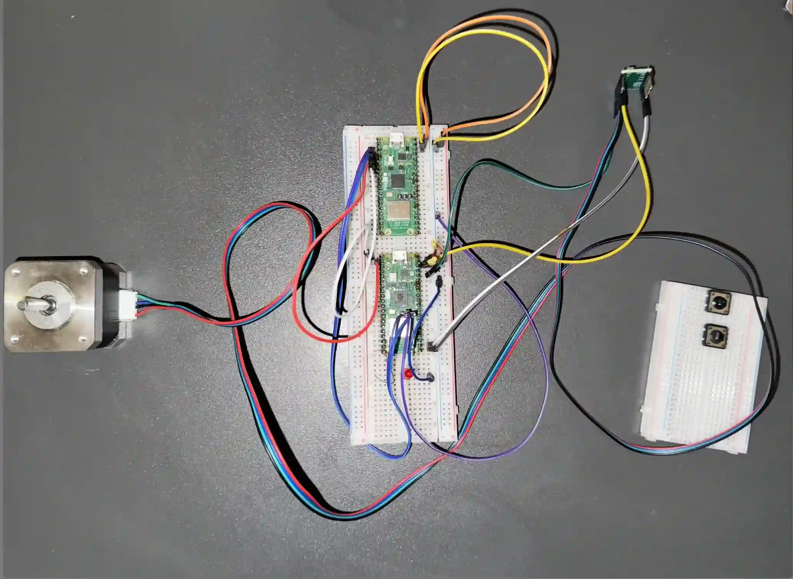
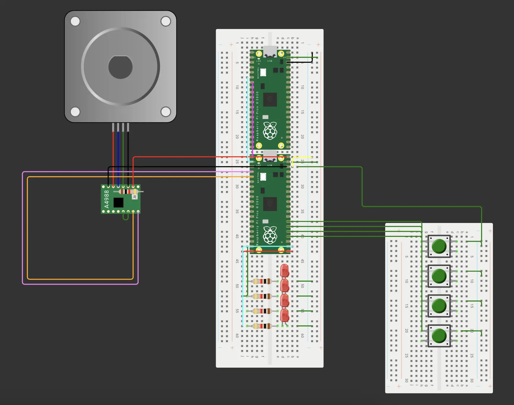

# Smart Elevator

:::info 

**Author**: Lazar Mihai \
**GitHub Project Link**: https://github.com/UPB-PMRust-Students/proiect-mihailazar6

:::

## Description

Modern elevators can waste time and energy by stopping at unnecessary floors or responding inefficiently to requests. This project introduces a smarter elevator that processes requests in real time, prioritizing efficient travel and reducing both wait times and energy consumption.

## Motivation
I chose this project because it addresses a real-world need for smarter, more efficient building systems. Elevators are critical for accessibility and convenience, and optimizing their operation can have a significant impact on energy use and user experience. This project combines my interest in automation and control with the challenge of creating a practical solution that benefits everyday life.

## Architecture 
 \

## Main Components

### 🟦 Input Module: Floor Request Buttons
- **Function:** Simulate user requests for specific floors.
- **Details:** Each button is wired to a GPIO input on the Raspberry Pi Pico 2W.

### 🟪 Controller Module: Raspberry Pi Pico 2W
- **Function:** Central brain that processes button inputs, manages the elevator request queue, determines optimal direction, and issues movement commands.
- **Features:** Real-time scheduling, efficient route planning, and queue management logic.

### 🟧 Output Module: Stepper Motor & Floor Indicators
- **Stepper Motor:** Simulates elevator movement between floors, controlled via the A4988 driver.
- **LED Indicators:** Display the current elevator floor and travel direction.

---

### 🔗 Component Connections

| Component        | Connection           | Purpose                                    |
|------------------|---------------------|--------------------------------------------|
| **Buttons**      | GPIO Inputs         | Capture floor requests from users          |
| **Pico 2W Logic**| GPIO Outputs        | Control LEDs and stepper motor driver      |
| **A4988 Driver** | Stepper Motor Pins  | Translate Pico signals to motor movement   |
| **LEDs**         | GPIO Outputs        | Indicate elevator position & direction     |

Schematic Overview:
- Buttons → **Pico 2W** (GPIO Inputs)
- **Pico 2W** (Logic) → LEDs & A4988 (GPIO Outputs)
- **A4988** → Stepper Motor (Controls elevator movement)

## Log

<!-- write your progress here every week -->

### Week 5 - 11 May

### Week 12 - 18 May

### Week 19 - 25 May

## Hardware
The **hardware components** used in this project are:

1. 🟢 **Raspberry Pi Pico 2W**  
   *Acts as the main controller, processing all elevator logic.*

2. ⬛ **Push Buttons**  
   *Simulate floor requests and elevator calls.*

3. 💡 **LEDs**  
   *Indicate elevator position and movement.*

4. 🔗 **Breadboard & Jumper Wires**  
   *Facilitate easy prototyping and circuit connections.*

5. 🌀 **Resistors**  
   *Protect LEDs and ensure reliable button input (pull-down configuration).*

6. ⚙️ **Stepper Motor**  
   *Physically simulates elevator movement between floors.*

7. 🟩 **A4988 Stepper Motor Driver**  
   *Precisely controls the stepper motor.*

8. 🔌 **Power Supply (USB)**  
   *Powers the Raspberry Pi Pico and peripherals.*

9. 🔔 **Buzzer**  
   *Provides auditory feedback for floor arrivals and events.*

---

These components combine to create an interactive, physical model of a smart elevator system—enabling the practical exploration of efficient control algorithms, real-time feedback, and responsive user interaction.

### Schematics

 

### Bill of Materials

<!-- Fill out this table with all the hardware components that you might need.

The format is 
```
| [Device](link://to/device) | This is used ... | [price](link://to/store) |

```

-->
| Device | Usage | Price |
|--------|--------|-------|
| [Raspberry Pi Pico 2W](https://www.optimusdigital.ro/en/raspberry-pi-boards/13327-raspberry-pi-pico-2-w.html?search_query=Raspberry+Pi+Pico+2&results=36) | The microcontroller | [35 RON](https://www.optimusdigital.ro/en/raspberry-pi-boards/12394-raspberry-pi-pico-w.html) |
| [Push Buttons (10 pack)](https://www.optimusdigital.ro/en/buttons-and-switches/8031-square-push-button-with-hold.html?search_query=button&results=491) | Floor request and elevator call buttons | [5 RON](https://www.optimusdigital.ro/en/buttons-and-switches/972-push-button-6x6x5mm.html) |
| [LEDs (assorted colors, 100 pack)](https://www.optimusdigital.ro/en/led-5mm/28-led-5mm-assorted-colors-100-pack.html) | Floor indicators and movement display | [25 RON](https://www.optimusdigital.ro/en/led-5mm/28-led-5mm-assorted-colors-100-pack.html) |
| [Breadboard](https://www.optimusdigital.ro/en/breadboards/8-breadboard-830-points.html) | Circuit prototyping | [15 RON](https://www.optimusdigital.ro/en/breadboards/8-breadboard-830-points.html) |
| [Jumper Wires (40 pack)](https://www.optimusdigital.ro/en/cables-and-wires/881-set-of-jumper-wires-mm-40-pieces.html) | Connecting components | [10 RON](https://www.optimusdigital.ro/en/cables-and-wires/881-set-of-jumper-wires-mm-40-pieces.html) |
| [Resistors Kit (600 pcs)](https://www.optimusdigital.ro/en/resistors/7-resistor-kit-600-pcs.html) | LED circuits and button pull-downs | [30 RON](https://www.optimusdigital.ro/en/resistors/7-resistor-kit-600-pcs.html) |
| [USB Cable](https://www.optimusdigital.ro/en/usb-cables/1344-usb-a-to-micro-usb-cable-15cm.html) | Power supply for Raspberry Pi Pico | [10 RON](https://www.optimusdigital.ro/en/usb-cables/1344-usb-a-to-micro-usb-cable-15cm.html) |
| [NEMA 17 Stepper Motor](https://www.optimusdigital.ro/en/stepper-motors/5057-17hs4401-stepper-motor-17-a-40-ncm.html?search_query=17HS4401&results=1) | Motor for the elevator | [45 RON](https://www.optimusdigital.ro/en/stepper-motors/2926-gm12-15byc-micro-gear-stepper-motor-130.html?search_query=stepper&results=151) |
| [A4988 Stepper Motor Driver](https://www.optimusdigital.ro/en/stepper-motor-drivers/108-a4988-stepper-motor-driver.html) | Driver for the stepper motor | [20 RON](https://www.optimusdigital.ro/en/stepper-motor-drivers/108-a4988-stepper-motor-driver.html) |
| [Buzzer (5V, 5mm)](https://www.optimusdigital.ro/en/speakers/1201-buzzer-5v-5mm.html) | Auditory feedback for floor arrival and other events | [5 RON](https://www.optimusdigital.ro/en/buzzers/12513-pcb-mounted-active-buzzer-module.html?search_query=buzzer&results=86) |
| **Total** | | **150 RON** |


## Software

| Library | Description | Usage |
|---------|-------------|-------|
| [embassy-rs](https://github.com/embassy-rs/embassy) | Async/await for embedded Rust | Main framework for asynchronous operations on the Raspberry Pi Pico 2W |
| [rp-pico](https://github.com/rp-rs/rp-pico) | HAL for Raspberry Pi Pico | Hardware abstraction layer for the Pico 2W microcontroller |
| [embedded-hal](https://github.com/rust-embedded/embedded-hal) | Hardware abstraction layer | Provides traits for embedded devices |
| [defmt](https://github.com/knurling-rs/defmt) | Debugging framework | Logging and debugging utilities |
| [embassy-time](https://docs.embassy.dev/embassy-time/) | Time management | Handling delays and timers in an async context |
| [embassy-executor](https://docs.embassy.dev/embassy-executor/) | Async executor | Running async tasks on the microcontroller |

## Links

<!-- Add a few links that inspired you and that you think you will use for your project -->

1. [link](https://example.com)
2. [link](https://example3.com)
...